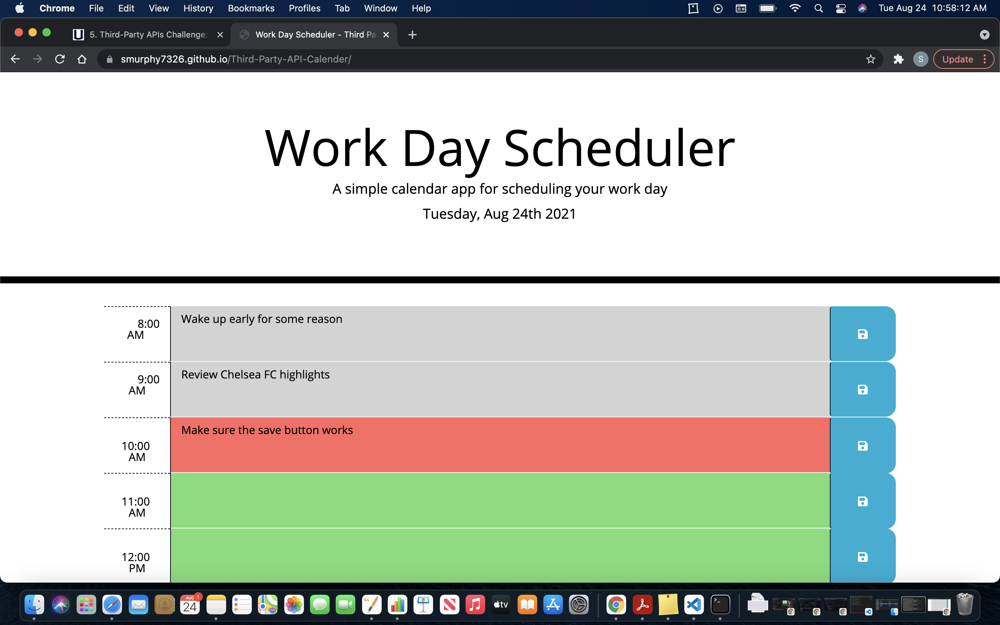

# Third-Party-API-Calender

## Purpose

In this project, I made a simple calender application that allows the user to create a planner that saves events for each hour of the day.

This was a Third Party API Challenge that used different technologies like Bootstrap Grids, and local storage to save and keep the events even after the page is refreshed. 

## Skills Used

* HTML
* CSS
* Bootstrap
* Moment.js
* jQuery
* Local Storage

[Third-Party-API](https://smurphy7326.github.io/Third-Party-API-Calender/)